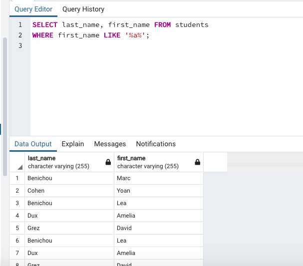
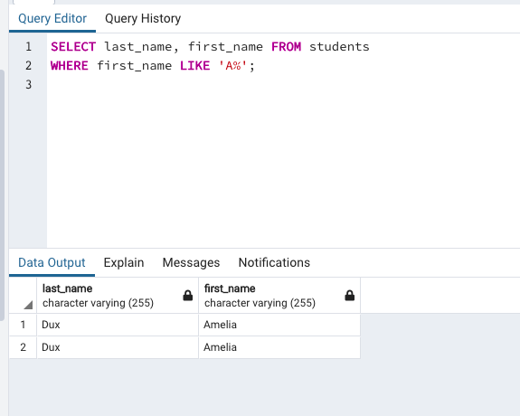

Create a database called bootcamp.
Create a table called students.
Add the following columns:
id
last_name
first_name
birth_date.
The id must be auto_incremented.
Make sure to choose the correct data type for each column.
To help, here is the data that you will have to insert. (How do we insert a date to a table?)

Insert
Insert the data seen above to the students table. Find the most efficient way to insert the data.

Insert your last_name, first_name and birth_date to the students table (Take a look at the id given).

Select

1. Fetch all of the data from the table.

2. Fetch all of the students first_names and last_names.

3. For the following questions, only fetch the first_names and last_names of the students.
  1. Fetch the student which id is equal to 2.

  

  2. Fetch the student whose last_name is Benichou AND first_name is Marc.

  

  3. Fetch the students whose last_names are Benichou OR first_names are Marc.

  

  4. Fetch the students whose first_names contain the letter a.

  

  5. Fetch the students whose first_names start with the letter a.

  

  6. Fetch the students whose first_names end with the letter a.

  

  7. Fetch the students whose second to last letter of their first_names are a (Example: Leah).

  8. Fetch the students whose id’s are equal to 1 AND 3 .

  
  

4. Fetch the students whose birth_dates are equal to or come after 1/01/2000. (show all their info).

