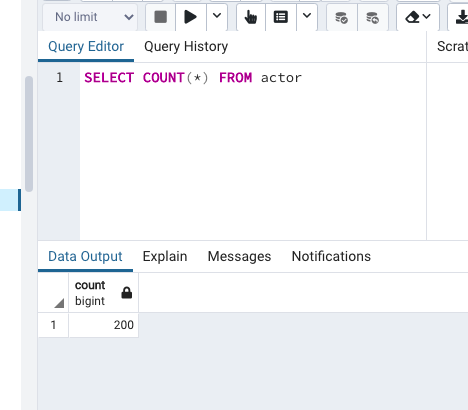
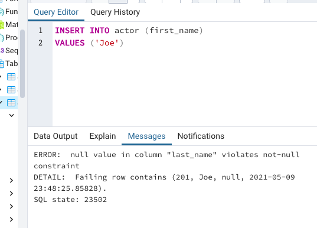
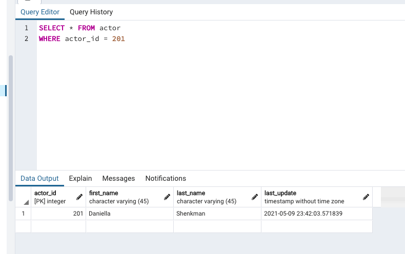

1. Count how many actors are in the table.

2. Try to add a new actor with some blank fields. What do you think the outcome will be ?

INSERT INTO actor (actor_id, first_name, last_name)
VALUES ('201', 'Daniella', 'Shenkman')

