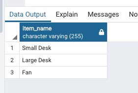
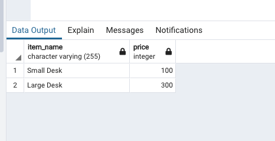
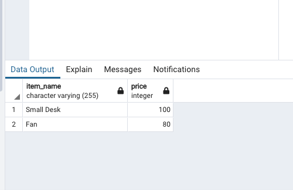
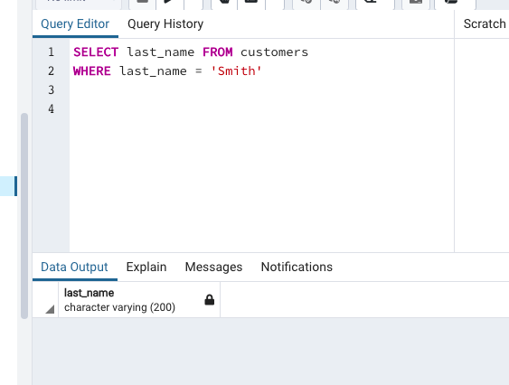
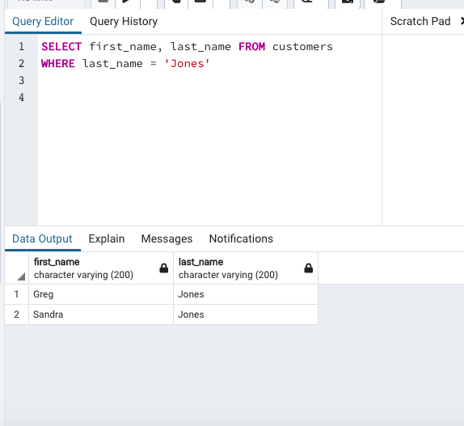
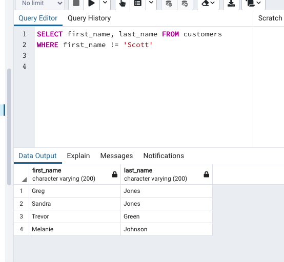

Use SQL to fetch the following data from the database:

1. All the items.

SELECT item_name FROM items

2. All the items with a price above 80 (80 not included).

SELECT item_name, price FROM items
WHERE price > 80

3. All the items with a price below 300. (300 included)

SELECT item_name, price FROM items
WHERE price < 300

4. All customers whose last name is ‘Smith’ (What will be your outcome?).

5. All customers whose last name is ‘Jones’.

6. All customers whose firstname is not ‘Scott’.

