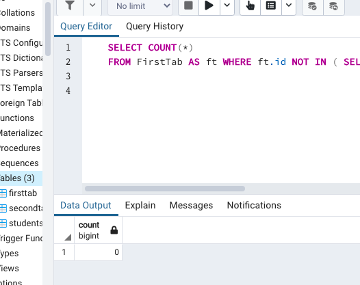
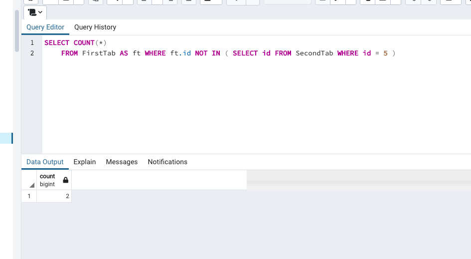
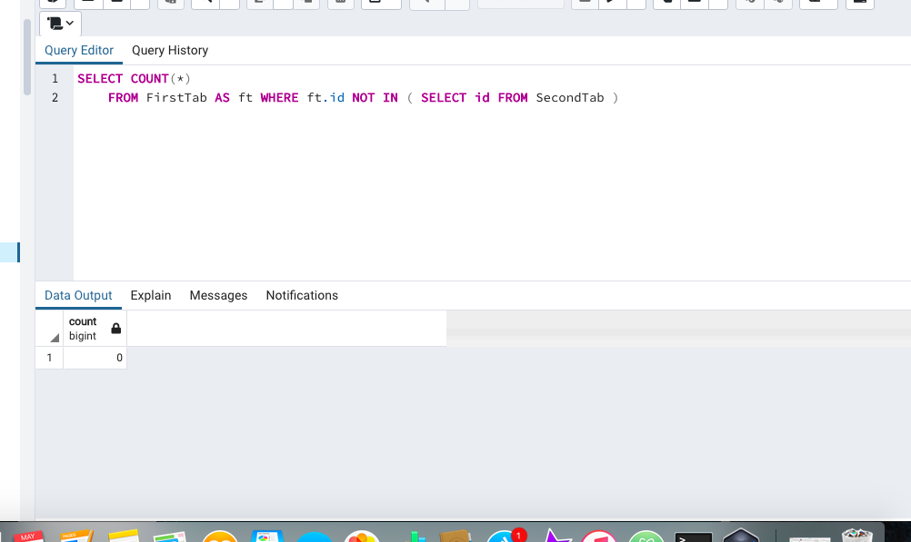
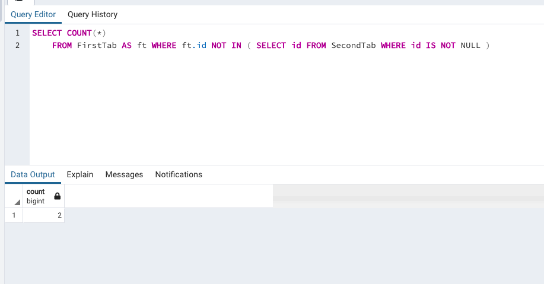

Q1. What will be the OUTPUT of the following statement?

SELECT COUNT(*)
FROM FirstTab AS ft WHERE ft.id NOT IN ( SELECT id FROM SecondTab WHERE id IS NULL )

I think the output will show a new column ft and the id that will show for ft will not be NULL

The output shows a column 'count' and the row shows 0

Q2. What will be the OUTPUT of the following statement?

    SELECT COUNT(*)
    FROM FirstTab AS ft WHERE ft.id NOT IN ( SELECT id FROM SecondTab WHERE id = 5 )

  I think the output will be a column of 'count' and the data in the row will be 3

   

  The data in the row was 2 (I thought it would count 'null' as a row)

  Q3. What will be the OUTPUT of the following statement?

    SELECT COUNT(*)
    FROM FirstTab AS ft WHERE ft.id NOT IN ( SELECT id FROM SecondTab )

    I think the output will be 2

    

    The output was 0

    Q4. What will be the OUTPUT of the following statement?

    SELECT COUNT(*)
    FROM FirstTab AS ft WHERE ft.id NOT IN ( SELECT id FROM SecondTab WHERE id IS NOT NULL )

    I think the output will be 2

    
