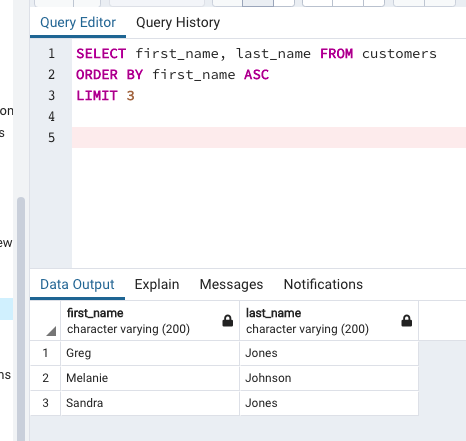
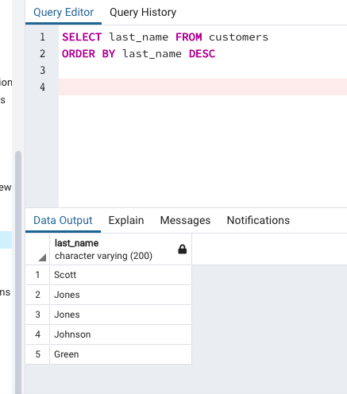
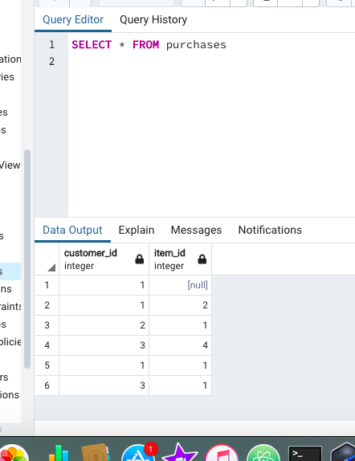

Exercise 1 : Items And Customers
Instructions
We will work on the public database that we created yesterday.

1. Use SQL to get the following from the database:

  1. All items, ordered by price (lowest to highest).

  

  2. Items with a price above 80 (80 included), ordered by price (highest to lowest).

  

  3. The first 3 customers in alphabetical order (A-Z) – exclude ‘id’ from the results.

  

  4. All last names (no other columns!), in reverse alphabetical order (Z-A)

  

  2. Create a table named purchases. It should have 2 columns : customer_id and item_id. These columns are references from the tables customers and items. Edit the data of the purchases table:
  

    1. Add a row which references a customer by ID, but does not reference an item by ID (leave it blank). Does this work? Why/why not? It worrks, but it shows that the item id is null

    
    

    2. Add 5 rows which reference existing customers and items.

    

  3. Use SQL to get the following from the database:
      1. All purchases. Is this information useful to us? No, because it is only numbers

      

      2. All purchases, joining with the customers table.
      

      3. Purchases of the customer with the ID equal to 4.
      My table is empty because when I added rows I did not set the customer with ID 4 to buy anything.
      

      4. Purchases for a large desk AND a small desk
      

  4. Create a purchase for Scott Scott – he bought a hard drive.
  

  5. Use SQL to show all the customers who have made a purchase. Show the following fields/columns:
      Customer first name
      Customer last name
      Item name

      

      Exercise 2 : Dvdrental Database

      1. In the dvdrental database write a query to select all the columns from the “customer” table.
      

      2. Write a query to display the names (first_name, last_name) using an alias named “full_name”.

      

      3. Lets get all the dates that accounts were created. Write a query to select all the create_date from the “customer” table (there should be no duplicates).
      

      4. Write a query to get all the customer details from the customer table, it should be displayed in descending order by their first name.
      

      5. Write a query to get the film ID, title, description, year of release and rental rate in ascending order according to their rental rate.

      

      6. Write a query to get the address, and the phone number of all customers living in the Texas district, these details can be found in the “address” table.
      

      7. Write a query to retrieve all movie details where the movie id is either 15 or 150.

      

      8. Write a query which should check if your favorite movie exists in the database. Have your query get the film ID, title, description, length and the rental rate, these details can be found in the “film” table.

      

      9. No luck finding your movie? Maybe you made a mistake spelling the name. Write a query to get the film ID, title, description, length and the rental rate of all the movies starting with the two first letters of your favorite movie.

      

      10. Write a query which will find the 10 cheapest movies.

      

      11. Not satisfied with the results. Write a query which will find the next 10 cheapest movies.

      SELECT film_id, title, description, length, rental_rate
      FROM film
      ORDER BY rental_rate ASC
      LIMIT 10 OFFSET 10;

      12. Write a query which will join the data in the customer table and the payment table. You want to get the amount and the date of every payment made by a customer, ordered by their id (from 1 to…).

      

      13. You need to check your inventory. Write a query to get all the movies which are not in inventory.

      14. Write a query to find which city is in which country.

      15. Bonus You want to be able to see how your sellers have been doing? Write a query to get the customer’s id, names (first and last), the amount and the date of payment ordered by the id of the staff member who sold them the dvd.
