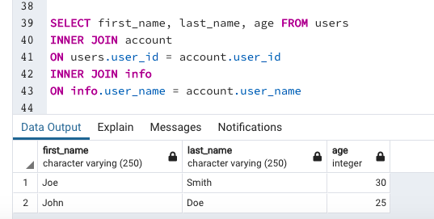
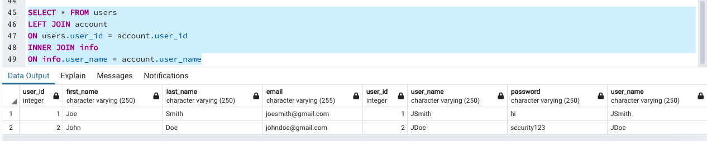
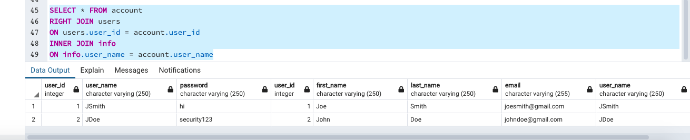
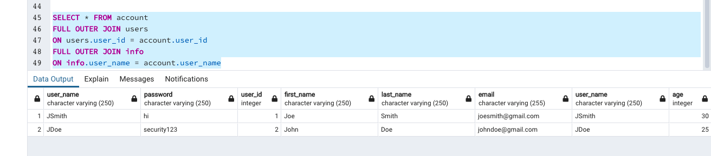
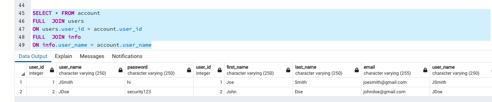

CREATE TABLE users (
	user_id serial PRIMARY KEY,
	first_name VARCHAR (250) NOT NULL,
	last_name VARCHAR (250) NOT NULL,
	email VARCHAR ( 255 ) UNIQUE NOT NULL
)

CREATE TABLE account (
	user_id serial,
	user_name VARCHAR (250) NOT NULL,
	password VARCHAR (250) NOT NULL,
	FOREIGN KEY(user_id)
	REFERENCES users(user_id)
)

CREATE TABLE info (
	user_name VARCHAR (250) NOT NULL,
	age integer

)

insert into users (first_name, last_name, email)
VALUES
('Joe', 'Smith', 'joesmith@gmail.com'),
('John', 'Doe', 'johndoe@gmail.com')

insert into account (user_name, password)
VALUES
('JSmith', 'hi'),
('JDoe', 'security123')

INSERT INTO info (user_name, age)
VALUES
('JSmith', 30),
('JDoe', 25)

SELECT first_name, last_name, age FROM users
INNER JOIN account
ON users.user_id = account.user_id
INNER JOIN info
ON info.user_name = account.user_name

SELECT * FROM account
FULL  JOIN users
ON users.user_id = account.user_id
FULL  JOIN info
ON info.user_name = account.user_name

