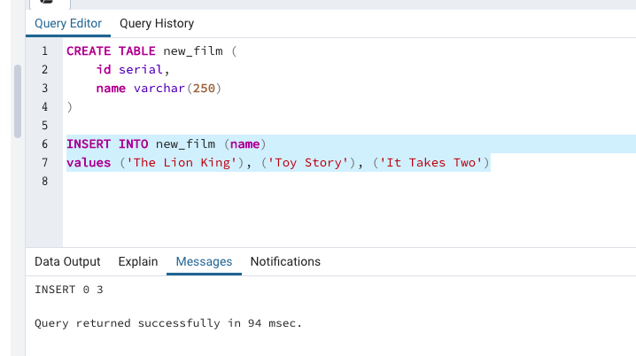
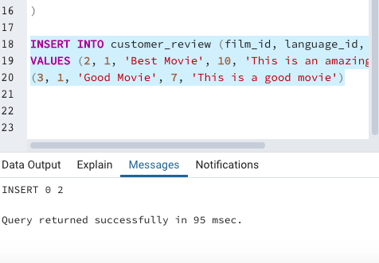
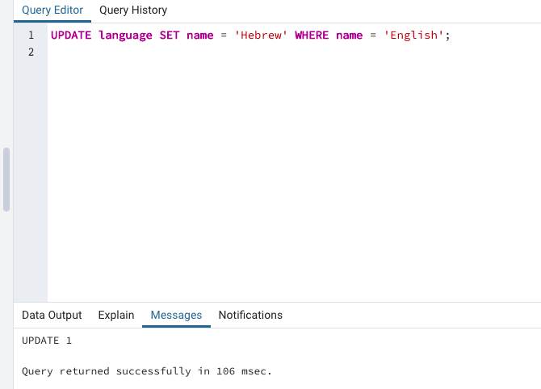
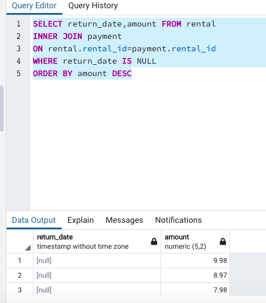
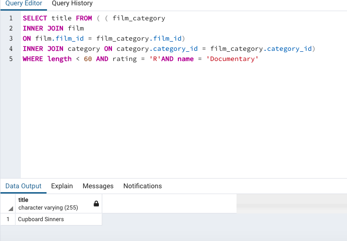
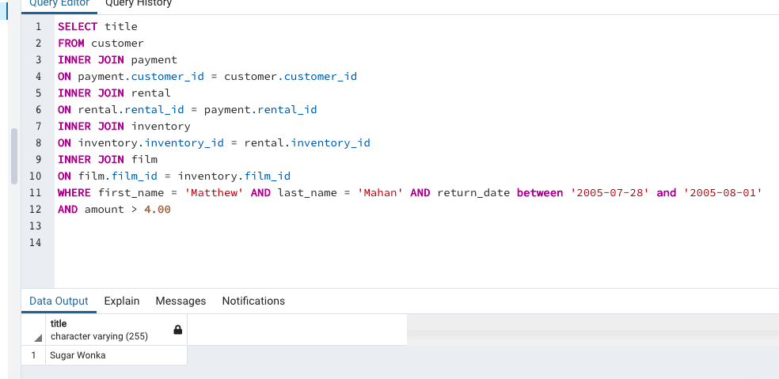
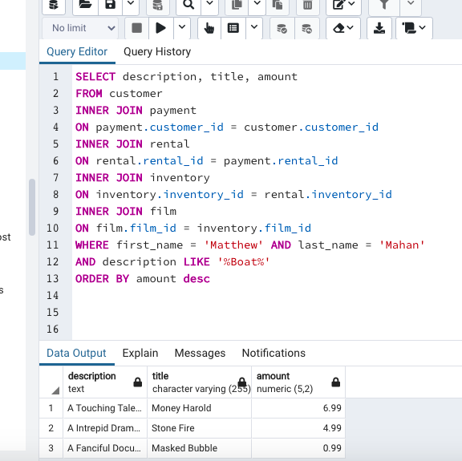

Exercise 1: DVD Rental
Instructions
Get a list of all film languages.

Get a list of all films joined with their languages – select the following details : film title, description, and language name. Try your query with different joins:

Get all films, even if they don’t have languages.

Get all languages, even if there are no films in those languages.

Create a new table called new_film with the following columns : id, name. Add some new films to the table.

Create a new table called customer_review, which will contain film reviews that customers will make.
Think about the DELETE constraint: if a film is deleted, it’s review should be automatically deleted.
It should have the following columns:
review_id – a primary key, non null, auto-increment.
film_id – references the new_film table. The film that is being reviewed.
language_id – references the language table. What language the review is in.
title – the title of the review.
score – the rating of the review (1-10).
review_text – the text of the review. No limit on the length.
last_update – when the review was last updated.

Add 2 movie reviews. Make sure you link them to valid objects in the other tables.

Delete a film that has a review from the new_film table, what happens to the customer_review table?

Exercise 2 : DVD Rental
Instructions
Use UPDATE to change the language of some films. Make sure that you use valid languages.

Which foreign keys (references) are defined for the customer table?  address_id
How does this affect the way in which we INSERT into the customer table? You have to reference it

We created a new table called customer_review. Drop this table. Is this an easy step, or does it need extra checking?

Find out how many rentals are still outstanding (ie. have not been returned to the store yet).

Find the 30 most expensive movies which are outstanding (ie. have not been returned to the store yet)

Your friend is at the store, and decides to rent a movie. He knows he wants to see 4 movies, but he can’t remember their names. Can you help him find which movies he wants to rent?
The 1st film : The film is about a sumo wrestler, and one of the actors is Penelope Monroe.

Park Citizen

The 2nd film : A short documentary (less than 1 hour long), rated “R”.

Cupboard Sinners

The 3rd film : A film that his friend Matthew Mahan rented. He paid over $4.00 for the rental, and he returned it between the 28th of July and the 1st of August, 2005.

Sugar Wonka

The 4th film : His friend Matthew Mahan watched this film, as well. It had the word “boat” in the title or description, and it looked like it was a very expensive DVD to replace.

Money Harold

